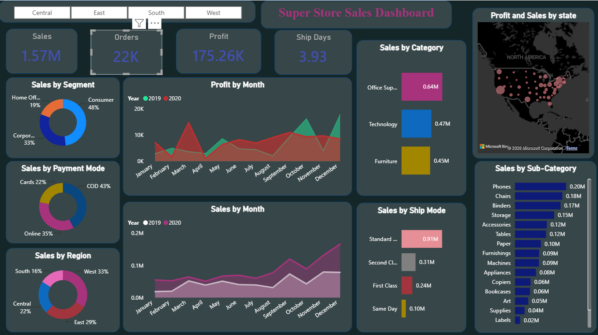
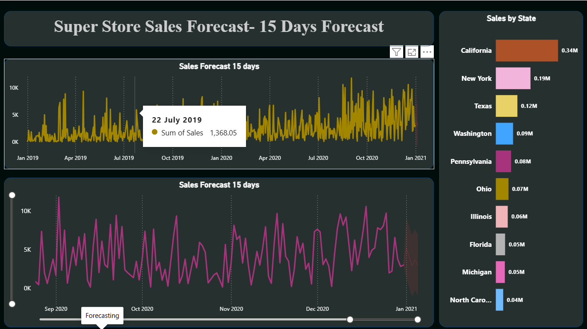

# 📊 Superstore Sales Performance Dashboard

An interactive **Power BI** dashboard built on the Superstore Sales dataset — tracking sales, profit, and delivery performance across categories, regions, and time, with a 15-day sales forecast.


---

## 🔍 Overview

This dashboard turns raw retail sales data into a clean, decision-ready view for business stakeholders — covering revenue trends, profitability by segment, regional performance, and a short-term sales forecast.

**At a glance:**

| Metric | Value |
|---|---|
| 💰 Total Sales | **1.57M** |
| 📈 Total Profit | **175.26K** |
| 📦 Orders | **22K** |
| 🚚 Avg. Ship Days | **3.93** |

## 🌟 What Makes This Stand Out

- **Predictive Forecasting** — The Forecasting page doesn't just plot historical data. It uses Power BI's built-in **exponential smoothing forecast algorithm** to project future sales trends, complete with a **95% confidence interval band**, so stakeholders can see both the predicted trend and its uncertainty range.
- **Live, Filter-Aware KPIs** — Every KPI card (Sales, Profit, Orders, Avg. Ship Days) is a **DAX aggregation**, not a static number. Click any slicer or chart, and every card and visual on the page recalculates instantly for that slice of data.
- **Full Cross-Filtering** — All visuals are interconnected. Selecting a region, category, or segment anywhere on the page filters every other visual in real time, letting users drill into exactly the insight they're after.

## ✨ Key Features

**KPI Summary Cards**
- Total Sales, Total Profit, Total Orders (Quantity), Average Ship Days

**Sales Breakdown**
- Sales by Category and Sub-Category
- Sales by Ship Mode
- Sales by Payment Mode
- Sales by Segment
- Sales by Region (with interactive region slicer)

**Trends**
- Monthly Sales trend (area chart)
- Monthly Profit trend (area chart)

**Geo Analysis**
- Profit and Sales by State (map visual)

**Forecasting**
- 15-day Sales Forecast (line chart)
- Sales by State — forecast page

## 📌 Key Insights

- **Office Supplies** leads category-wise sales at 0.64M, followed by Technology (0.47M) and Furniture (0.45M)
- **Phones, Chairs, and Binders** are the top-performing sub-categories
- **Standard Class** shipping accounts for the majority of sales (0.91M), well ahead of Second Class, First Class, and Same Day
- **Consumer segment** drives the most sales (48%), followed by Corporate (33%) and Home Office (19%)
- **COD (43%)** is the leading payment mode, followed by Online (35%) and Cards (22%)
- **West (33%)** and **East (29%)** regions contribute the highest share of sales
- **California, New York, and Texas** are the top-selling states
- Sales show a clear year-over-year uptick from 2019 to 2020, with the 15-day forecast projecting continued upward momentum

## 🖥️ Report Pages

| Page | Description |
|---|---|
| **Dashboard** | Main KPI overview with sales/profit breakdowns by category, region, segment, ship mode, payment mode, and a state-level map |
| **Forecasting** | 15-day sales forecast trend and state-wise sales comparison |

## 🛠️ Tech Stack

- **Power BI Desktop** — data modeling, DAX measures, report design
- **DAX** — aggregations (Sales, Profit, Quantity, Avg. Delivery Days)
- **Dataset** — Superstore Sales dataset

## 📸 Screenshots

**Dashboard**


**Forecasting**


## 🚀 How to Use

1. Clone this repository
   ```bash
   git clone https://github.com/<your-username>/superstore-sales-dashboard.git
   ```
2. Open `Sales_Dashboard.pbix` in **Power BI Desktop** (free download from Microsoft)
3. Interact with slicers and visuals to explore sales, profit, and forecast trends

## 📁 Repository Structure

```
superstore-sales-dashboard/
├── Sales_Dashboard.pbix
├── README.md
└── screenshots/
```

## 👤 Author

Built by **Mehak Rana**

---

⭐ If you found this useful, consider starring the repo!
